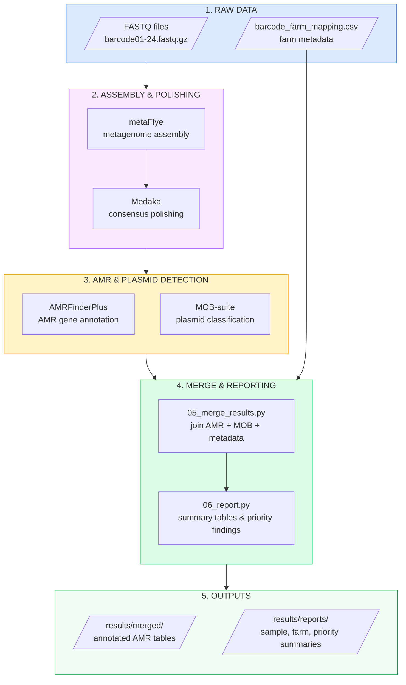
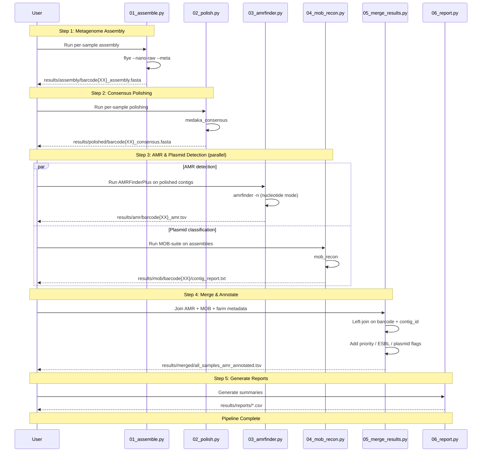
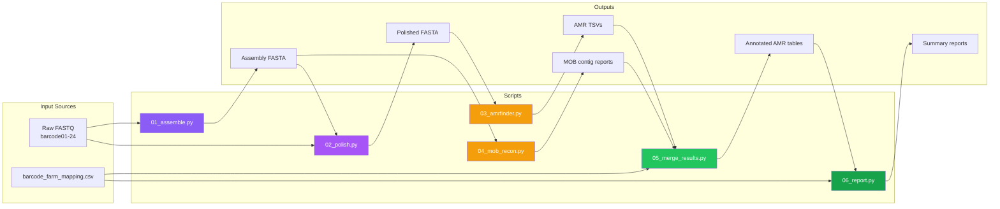
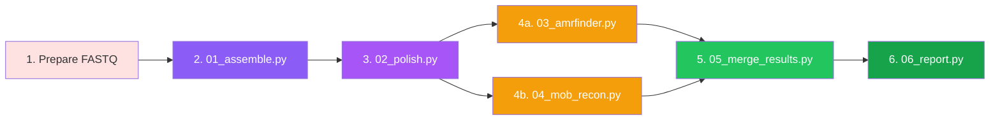
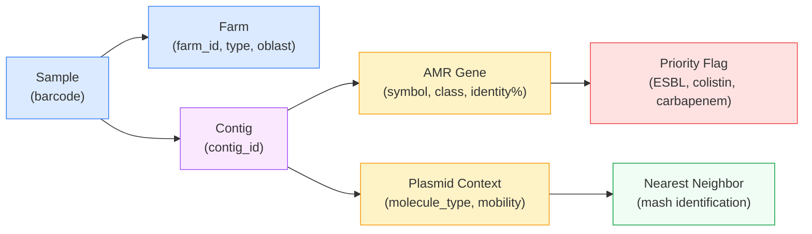
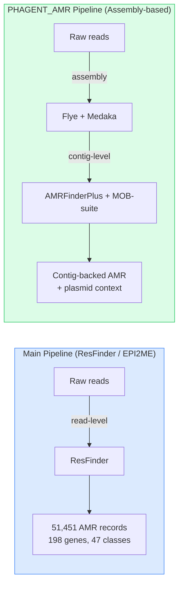

# PHAGENT_AMR Workflow Documentation

This document provides visual documentation of the assembly-based AMR profiling pipeline.

---

## Pipeline Overview

---

## Data Flow Sequence

---

## Data Transformation Diagram

```mermaid
flowchart LR
    subgraph RAW["Raw Reads"]
        R1["barcode07.fastq.gz<br/>~thousands of reads"]
        R2["barcode08.fastq.gz"]
        R3["...24 samples"]
    end

    subgraph CONTIGS["Assembled Contigs"]
        C1["barcode07_assembly.fasta<br/>4 contigs, 5.6 KB"]
        C2["barcode08_assembly.fasta<br/>4 contigs, 13 KB"]
        C3["..."]
    end

    subgraph POLISHED["Polished Consensus"]
        P1["barcode07_consensus.fasta<br/>2 contigs, 5.5 KB"]
        P2["barcode08_consensus.fasta<br/>4 contigs, 13 KB"]
        P3["..."]
    end

    subgraph AMR_HITS["AMR Detections"]
        A1["barcode07_amr.tsv<br/>1 gene: qnrD1"]
        A2["barcode08_amr.tsv<br/>0 genes"]
        A3["..."]
    end

    subgraph MOB_CLASS["Plasmid Classification"]
        M1["contig_report.txt<br/>chromosome vs plasmid<br/>per contig"]
    end

    subgraph MERGED["Annotated AMR Table"]
        MG["all_samples_amr_annotated.tsv<br/>gene + contig + plasmid + farm"]
    end

    subgraph REPORTS["Summary Reports"]
        S1["amr_summary_by_sample.csv"]
        S2["priority_findings.csv"]
        S3["cross_sample_summary.csv"]
        S4["farm_level_summary.csv"]
    end

    RAW -->|"Flye --meta"| CONTIGS
    CONTIGS -->|"Medaka"| POLISHED
    POLISHED -->|"AMRFinderPlus -n"| AMR_HITS
    CONTIGS -->|"MOB-recon"| MOB_CLASS
    AMR_HITS --> MERGED
    MOB_CLASS --> MERGED
    MERGED --> REPORTS

    style RAW fill:#dbeafe,stroke:#3b82f6
    style CONTIGS fill:#ede9fe,stroke:#8b5cf6
    style POLISHED fill:#fae8ff,stroke:#a855f7
    style AMR_HITS fill:#fef3c7,stroke:#f59e0b
    style MOB_CLASS fill:#fef3c7,stroke:#f59e0b
    style MERGED fill:#dcfce7,stroke:#22c55e
    style REPORTS fill:#f0fdf4,stroke:#16a34a
```

---

## Script Dependencies

---

## File Structure

```mermaid
graph TD
    ROOT["PHAGENT_AMR/"]

    ROOT --> INPUT_DIR["Input/"]
    ROOT --> CODE["Code/"]
    ROOT --> SCRIPTS["scripts/"]
    ROOT --> RESULTS["results/"]
    ROOT --> DOCS["Docs/"]

    INPUT_DIR --> ZIP["WW_FarmUAA_RLB_20250219-fastqs.zip"]

    CODE --> NB1["contigs_for_barcode_v1.ipynb"]
    CODE --> NB2["contigs_for_barcode_v2.ipynb"]
    CODE --> NB3["mob_result.ipynb"]

    SCRIPTS --> SC1["01_assemble.py"]
    SCRIPTS --> SC2["02_polish.py"]
    SCRIPTS --> SC3["03_amrfinder.py"]
    SCRIPTS --> SC4["04_mob_recon.py"]
    SCRIPTS --> SC5["05_merge_results.py"]
    SCRIPTS --> SC6["06_report.py"]

    RESULTS --> ASM_DIR["assembly/"]
    RESULTS --> POL_DIR["polished/"]
    RESULTS --> AMR_DIR["amr/"]
    RESULTS --> MOB_DIR["mob/"]
    RESULTS --> MRG_DIR["merged/"]
    RESULTS --> RPT_DIR["reports/"]

    MRG_DIR --> MRG1["all_samples_amr_annotated.tsv"]
    MRG_DIR --> MRG2["barcode{XX}_amr_annotated.tsv"]

    RPT_DIR --> R1["amr_summary_by_sample.csv"]
    RPT_DIR --> R2["priority_findings.csv"]
    RPT_DIR --> R3["cross_sample_summary.csv"]
    RPT_DIR --> R4["farm_level_summary.csv"]

    DOCS --> DOC1["WORKFLOW.md"]
    DOCS --> DOC2["REPRODUCE.md"]

    style ROOT fill:#f0f9ff
    style INPUT_DIR fill:#fee2e2
    style CODE fill:#f5f5f4
    style SCRIPTS fill:#fae8ff
    style RESULTS fill:#dcfce7
    style DOCS fill:#dbeafe
```

---

## Execution Order

**Note:** Steps 4a and 4b can run in parallel after step 3.

---

## Evidence Model

Each AMR finding is traceable through the full chain:

---

## Tool Chain Summary

| Step | Tool | Input | Output | Key Parameters |
|------|------|-------|--------|----------------|
| Assembly | metaFlye | Raw FASTQ | Contigs FASTA | `--nano-raw --meta` |
| Polishing | Medaka | FASTQ + Assembly | Consensus FASTA | `-m r1041_e82_400bps_sup_v5.2.0` |
| AMR Detection | AMRFinderPlus | Polished contigs | AMR gene TSV | `-n` (nucleotide mode) |
| Plasmid Typing | MOB-suite | Assembly contigs | Contig report | `mob_recon` |
| Merge | Python/pandas | AMR + MOB + metadata | Annotated table | Left joins on barcode + contig |
| Report | Python/pandas | Annotated table | Summary CSVs | Priority filtering, aggregation |

---

## Comparison with Main Pipeline

| Aspect | Main Pipeline | PHAGENT_AMR |
|--------|---------------|-------------|
| AMR source | ResFinder (read-level) | AMRFinderPlus (contig-level) |
| Evidence type | Individual reads | Assembled contigs |
| Plasmid context | None | MOB-suite classification |
| Confidence | Coverage % + Identity % | Assembly + gene coordinates |
| Scope | All 24 barcodes | Currently 4 (scalable to 24) |
| Best for | Broad screening | High-confidence, evidence-backed findings |

---
