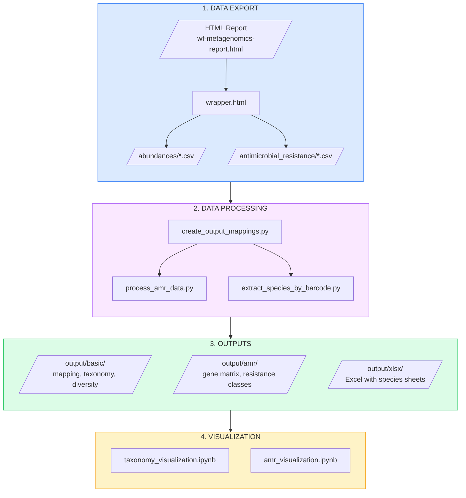
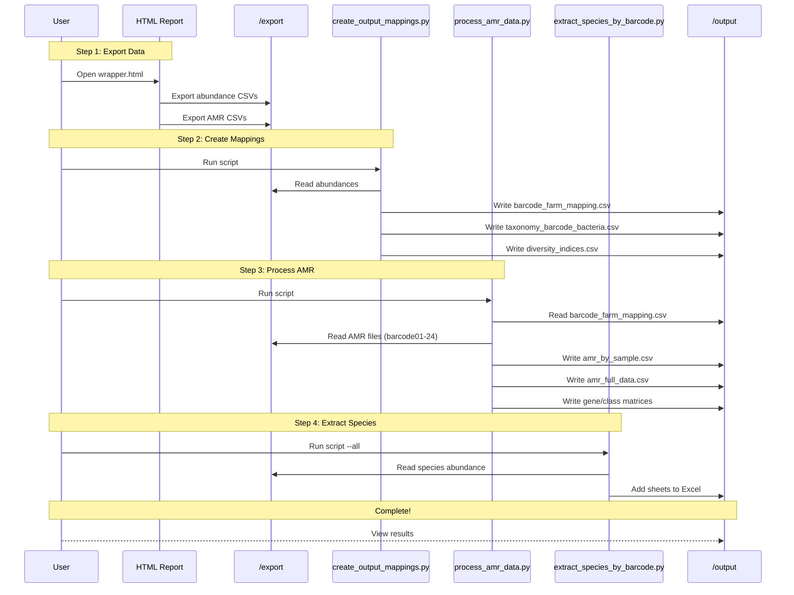
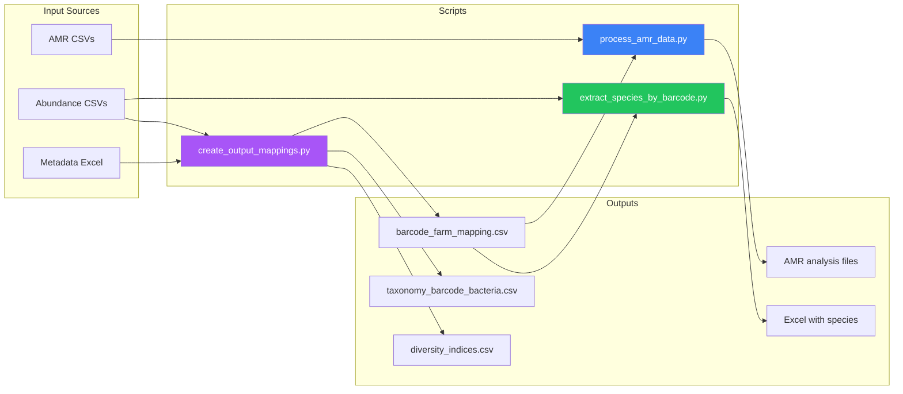
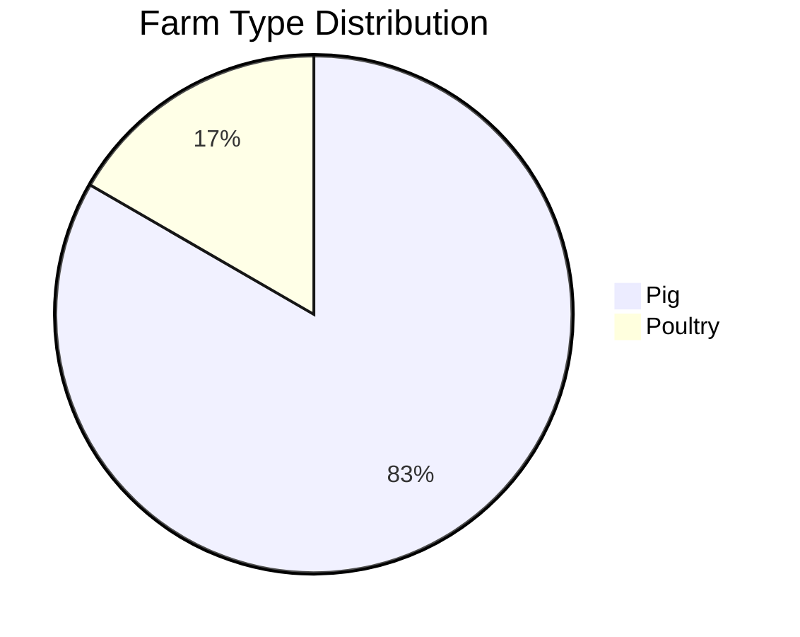
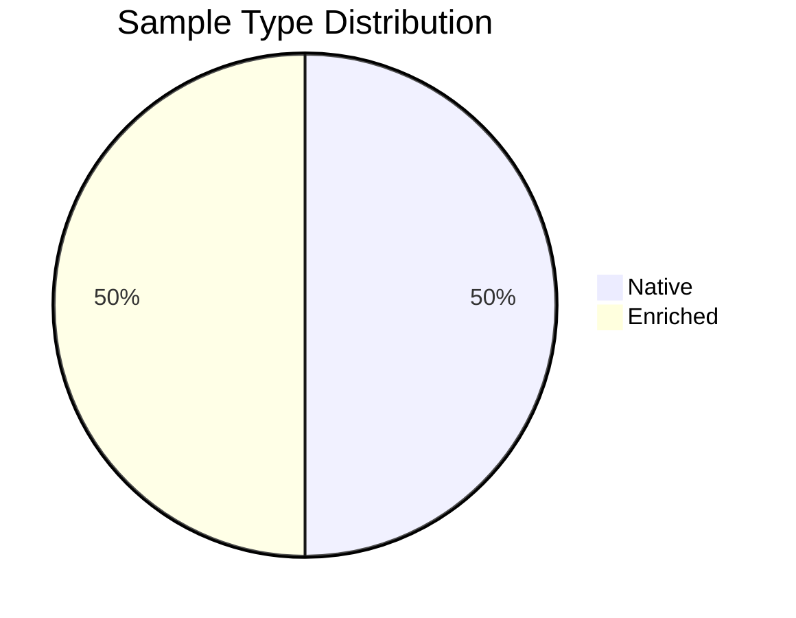

# Workflow Documentation

This document provides visual documentation of the bio-phagent data pipeline.

---

## Pipeline Overview



---

## Data Flow Sequence



---

## File Structure

```mermaid
graph TD
    ROOT["bio-phagent/"]

    ROOT --> INPUT["input/"]
    ROOT --> WIP["wip/"]
    ROOT --> EXPORT["export/"]
    ROOT --> OUTPUT["output/"]
    ROOT --> SCRIPTS["scripts/"]
    ROOT --> DOCS["*.md"]

    INPUT --> HTML["wf-metagenomics-report.html"]
    INPUT --> WRAP["wrapper.html"]

    WIP --> META["[WIP] UA_FARM_WW_CLEAN_METADATA.xlsx"]

    EXPORT --> ABD["abundances/"]
    EXPORT --> AMR["antimicrobial_resistance/"]

    ABD --> TABLE["table/ (6 files)"]
    ABD --> RARE["rarefied/ (6 files)"]
    AMR --> AMRCSV["amr_barcode01-24.csv"]

    OUTPUT --> BASIC["basic/"]
    OUTPUT --> AMRDIR["amr/"]
    OUTPUT --> XLSX["xlsx/"]

    BASIC --> BFM["barcode_farm_mapping.csv"]
    BASIC --> TBB["taxonomy_barcode_bacteria.csv"]
    BASIC --> DIV["diversity_indices.csv"]
    BASIC --> TNOTE["taxonomy_visualization.ipynb"]

    AMRDIR --> ABS["amr_by_sample.csv"]
    AMRDIR --> AFD["amr_full_data.csv"]
    AMRDIR --> AGM["amr_gene_matrix.csv"]
    AMRDIR --> ARC["amr_resistance_class_matrix.csv"]
    AMRDIR --> ANOTE["amr_visualization.ipynb"]

    XLSX --> XLSXF["[FINAL] UA_FARM_WW_CLEAN_METADATA.xlsx"]

    SCRIPTS --> S1["create_output_mappings.py"]
    SCRIPTS --> S2["process_amr_data.py"]
    SCRIPTS --> S3["extract_species_by_barcode.py"]

    style ROOT fill:#f0f9ff
    style INPUT fill:#fee2e2
    style EXPORT fill:#dbeafe
    style OUTPUT fill:#dcfce7
    style SCRIPTS fill:#fae8ff
```



---

## Script Dependencies



---

## Input/Output Schemas

### Abundance Table Format

```
| species      | barcode01 | barcode02 | ... | barcode24 | phylum   | class     | ... |
|--------------|-----------|-----------|-----|-----------|----------|-----------|-----|
| E. coli      | 15234     | 12456     | ... | 8923      | Pseudo.. | Gamma..   | ... |
```

### AMR File Format

```
| Gene         | ReadID                               | Coverage % | Identity % | Resistance          |
|--------------|--------------------------------------|------------|------------|---------------------|
| aph(3'')-Ib  | b963a3b5-5373-43f2-8d97-47fbacb269fa | 98.76      | 96.56      | Streptomycin        |
| tetA         | c1d2e3f4-...                         | 95.43      | 98.21      | Tetracycline;Chlor.. |
```

### Output: barcode_farm_mapping.csv

```
| barcode   | sample_id | farm_type | farm_id     | sample_type | oblast              |
|-----------|-----------|-----------|-------------|-------------|---------------------|
| barcode01 | 1.1.      | Poultry   | poultry #1  | Native      | Zaporizhzhia Oblast |
| barcode02 | 1.1. n    | Poultry   | poultry #1  | Enriched    | Zaporizhzhia Oblast |
```

### Output: amr_by_sample.csv

```
| barcode   | farm_type | total_gene_detections | unique_reads | unique_genes | unique_resistance_classes |
|-----------|-----------|----------------------|--------------|--------------|---------------------------|
| barcode01 | Poultry   | 247                  | 211          | 13           | 27                        |
| barcode02 | Poultry   | 2727                 | 2586         | 46           | 22                        |
```

---

## Execution Order


**Note:** Steps 3 and 4 can run in parallel after step 2.

---

## Sample Distribution





---

*Generated for bio-phagent metagenomics pipeline - December 2024*
